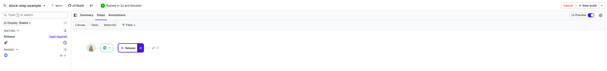
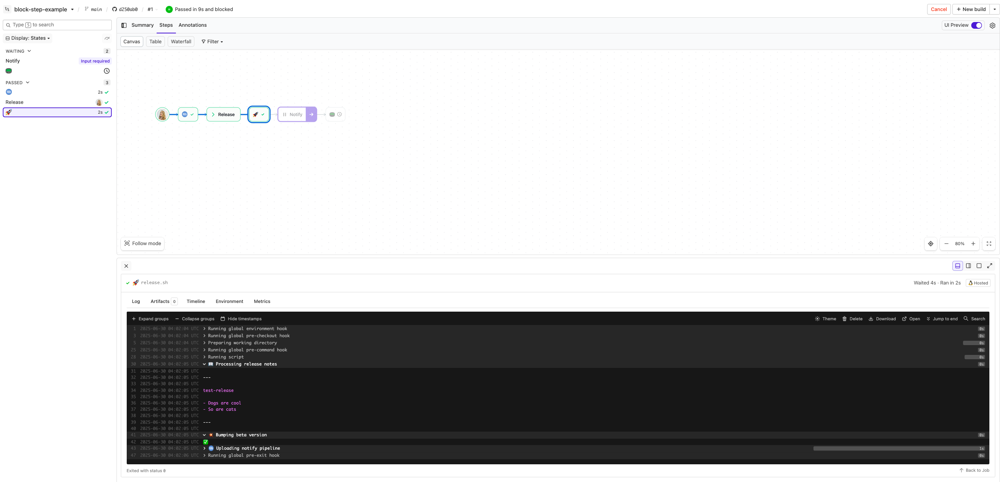
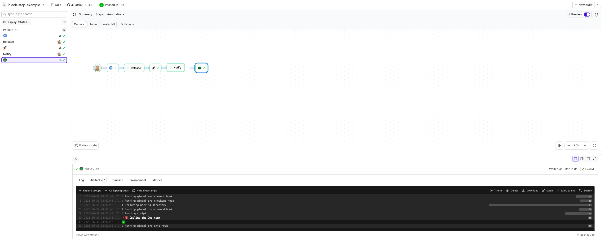

# Buildkite Block Step Example

This repository is an example [Buildkite](https://buildkite.com/) pipeline that demonstrates how to use a [Block Step](https://buildkite.com/docs/pipelines/block-step-example) to pause a build and prompt for manual input.

👉 **See this example in action:** [https://buildkite.com/buildkite/block-step-example](https://buildkite.com/buildkite/block-step-example/builds/latest?branch=main)

See the full [Getting Started Guide](https://buildkite.com/docs/guides/getting-started) for step-by-step instructions on how to get this running, or try it yourself:

<em>The build is paused at the first block step, prompting for release details</em>

<em>The release form with fields for name, changelog, and release type</em>

<em>The pipeline resumes after the first block step, with the notify step next in the build</em>

<em>The notify input dialog prompting for which team should be notified</em>

<em>The pipeline completes, and the release script logs all submitted input values</em>

---
<!-- docs:start -->
## How it works

This example:
- Uses a [Block Step](https://buildkite.com/docs/pipelines/block-step) with custom input fields.
- Includes a [`release.sh`](release.sh) script that reads values entered during the block step.
- Dynamically generates prompt fields using [`generate-notify-pipeline.sh`](generate-notify-pipeline.sh).

<!-- docs:end -->
---

## License

See [LICENSE](LICENSE.md) (MIT)
